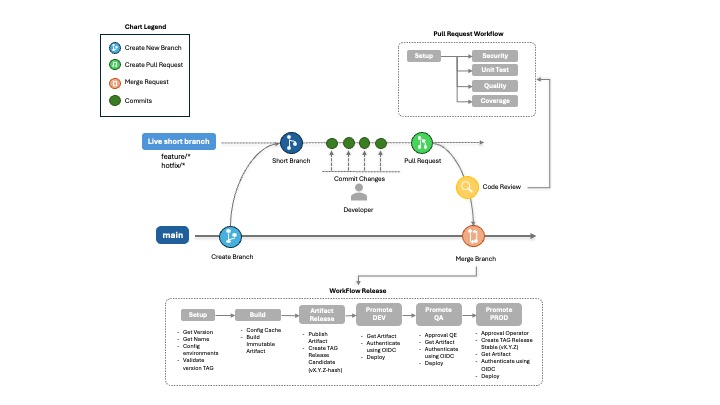

# Git Workflow & Release Pipeline
 
Este documento describe el flujo de trabajo de desarrollo y release basado en el diagrama de branching y CI/CD.
 
---
 
## Tabla de Contenidos
 
- [Convenciones de Ramas](#convenciones-de-ramas)
- [Flujo de Desarrollo](#flujo-de-desarrollo)
- [Pull Request Workflow](#pull-request-workflow)
- [WorkFlow Release](#workflow-release)
- [Certificación / Firma del APK](#certificación--firma-del-apk)
- [Cómo Descargar el APK Generado](#cómo-descargar-el-apk-generado)
---
 
## Convenciones de Ramas
 
| Tipo | Nomenclatura | Descripción |
|------|-------------|-------------|
| Principal | `main` | Rama estable de producción |
| Corta (feature) | `feature/*` | Nueva funcionalidad |
| Corta (hotfix) | `hotfix/*` | Corrección urgente en producción |
 
---
 
## Flujo de Desarrollo
 
El ciclo de vida de un cambio sigue estos pasos:
 
```
main
 └─► Create Branch
       └─► Short Branch (feature/* o hotfix/*)
             └─► Commit Changes  (desarrollador realiza commits)
                   └─► Pull Request
                         └─► Code Review
                               └─► Merge Branch ──► main
```
 
### Pasos detallados
 
1. **Create Branch** — A partir de `main` se crea una rama corta (`feature/*` o `hotfix/*`).
2. **Commit Changes** — El desarrollador realiza uno o más commits sobre la rama corta.
3. **Pull Request** — Al completar el trabajo se abre un Pull Request hacia `main`.
4. **Code Review** — Un revisor aprueba o solicita cambios.
5. **Merge Branch** — Una vez aprobado, la rama se fusiona a `main`.
---
 
## Pull Request Workflow
 
Cuando se abre un Pull Request se ejecutan automáticamente las siguientes etapas en paralelo:
 
```
Pull Request
 └─► Setup
       ├─► Security    (análisis de vulnerabilidades)
       ├─► Unit Test   (pruebas unitarias)
       ├─► Quality     (análisis de calidad de código)
       └─► Coverage    (cobertura de pruebas)
```
 
Todas las etapas deben pasar antes de que el PR pueda ser mergeado.
 
---
 
## WorkFlow Release
 
Una vez que los cambios llegan a `main`, se ejecuta el pipeline de release compuesto por seis etapas secuenciales:
 
### Etapa 1 — Setup
 
- Obtener versión (`Get Version`)
- Obtener nombre (`Get Name`)
- Configurar entornos (`Config environments`)
- Validar versión TAG (`Validate version TAG`)
### Etapa 2 — Build
 
- Config Cache
- Build
- Immutable Artifact
### Etapa 3 — Artifact Release
 
- Publicar Artifact (`Publish Artifact`)
- Crear TAGs de release (`Create TAG Releases Candidate`)
- Versionar con hash (`vX.Y.Z-hash`)
### Etapa 4 — Promote DEV
 
- Obtener Artifact (`Get Artifact`)
- Autenticar con OIDC (`Authenticate using OIDC`)
- Desplegar (`Deploy`)
### Etapa 5 — Promote QA
 
- Aprobación QE (`Approval QE`)
- Obtener Artifact (`Get Artifact`)
- Autenticar con OIDC (`Authenticate using OIDC`)
- Desplegar (`Deploy`)
### Etapa 6 — Promote PROD
 
- Aprobación del Operador (`Approval Operator`)
- Crear TAG de release (`Create TAG Release`)
- Versión estable (`Stable vX.Y.Z`)
- Obtener Artifact (`Get Artifact`)
- Autenticar con OIDC (`Authenticate using OIDC`)
- Desplegar (`Deploy`)
### Diagrama del pipeline de release
 
```
Setup ──► Build ──► Artifact Release ──► Promote DEV ──► Promote QA ──► Promote PROD
```
 
> Las etapas **Promote QA** y **Promote PROD** requieren aprobación manual antes de continuar.
 
---
 
## Certificación / Firma del APK
 
El build de Android utiliza un **Keystore** para firmar el APK y el AAB antes de ser distribuidos. Las credenciales se gestionan como variables de repositorio en GitHub Actions y **nunca deben commitearse al código fuente**.
 
| Variable | Descripción |
|---|---|
| `KEYSTORE_PATH` | Ruta al archivo `.keystore` dentro del proyecto |
| `KEYSTORE_PASSWORD` | Contraseña del keystore (también usada como `key_password`) |
| `KEY_ALIAS` | Alias de la clave dentro del keystore |
| `ANDROID_KEYSTORE_BASE64` | Contenido del keystore codificado en Base64 |
 
### Configurar el Keystore en el repositorio
 
1. Codificar el archivo keystore en Base64:
   ```bash
   base64 -i your-key.keystore | pbcopy   # macOS
   base64 -w 0 your-key.keystore          # Linux
   ```
2. En GitHub, ir a **Settings → Secrets and variables → Actions → Variables**.
3. Crear las variables `KEYSTORE_PATH`, `KEYSTORE_PASSWORD`, `KEY_ALIAS` y `ANDROID_KEYSTORE_BASE64` con sus valores correspondientes.
> El pipeline firma el APK automáticamente durante el job **Build** usando la action `mobile/build/android`. Si alguna variable está ausente o incorrecta, el build fallará en la etapa de firma.
 
---
 
## Cómo Descargar el APK Generado
 
El APK se genera únicamente cuando hay un **push a `main`**. Hay tres formas de obtenerlo:
 
### Opción 1 — Desde Firebase App Distribution
 
El job `distribute` sube el APK automáticamente a **Firebase App Distribution** con el `app_id`:
```
1:432490436563:android:fee35c44f2f2ccf59b4126
```
 
Los testers invitados recibirán una notificación y podrán instalar el APK directamente desde la app de Firebase App Distribution en su dispositivo.
 
### Opción 2 — Desde los Artefactos del Workflow (temporal)
 
Los artefactos se retienen por **1 día** (`retention-days: 1`) y están disponibles durante ese período:
 
1. Ir a **Actions** en el repositorio de GitHub.
2. Seleccionar el workflow run correspondiente.
3. En la sección **Artifacts**, descargar `android-release-files`.
4. Descomprimir y localizar el APK en:
   ```
   app/build/outputs/apk/release/<app_name>-<version>.apk
   ```
 
> Se recomienda usar **Releases** o **Firebase App Distribution** para compartir builds con QA o stakeholders, ya que los artefactos del workflow expiran en 1 día.
---

## Diagrama del Flujo Completo



---

## Notas

- El versionado sigue el esquema **SemVer** (`vX.Y.Z`).
- Los artefactos son **inmutables**: una vez construidos no se recompilan, solo se promueven entre ambientes.
- La autenticación en todos los ambientes se realiza mediante **OIDC** (sin secretos estáticos).
- El flujo de ramas cortas (`feature/*`, `hotfix/*`) garantiza que `main` siempre permanezca en estado desplegable.
 